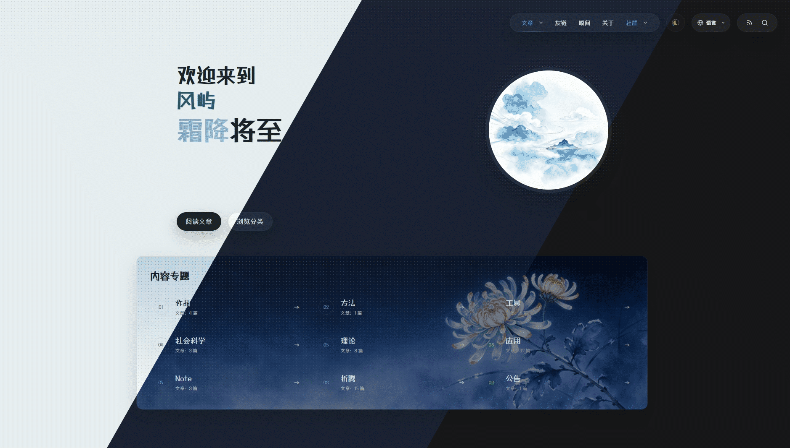

<p align="center">
  
</p>

<h1 align="center">风屿 · Wind Island</h1>

<p align="center">
  A restrained, serene Halo theme centered on native content and navigation
</p>

<p align="center">
  <sub>Adapted from <a href="https://github.com/DINGDANGMAOUP/moonlit-mountain">DINGDANGMAOUP/moonlit-mountain</a></sub>
</p>

<p align="center">
  <a href="https://www.halo.run/"></a>
  <a href="./LICENSE"></a>
  <a href="./CHANGELOG.md"></a>
</p>

---

## ✨ Features

### 🏝️ Island Color System

Four color schemes, switchable in one click from the top-right corner, with smooth View Transition animations.

| Island Color | Description |
|---|---|
| **Night Island** 夜屿 | Dark theme, current default brand |
| **Dusk Island** 暮屿 | Blue hour and afterglow tones |
| **Dawn Island** 晓屿 | Light theme, silver paper and ink |
| **Follow System** 随境 | Automatically follows device preference |

### 🎨 Rich Theme Settings

Customize via Halo Admin → Theme Settings:

- **Appearance** — Custom web fonts, default island color
- **Homepage** — Hero image, cover strip source (pinned / category / tag), about page, featured categories
- **Navigation** — Social media (up to 5, with icons, links, and image popups)
- **Articles** — Reading settings panel (font size, line height, content width adjustable in real time)
- **Footer** — ICP filing number, public security network filing number

### 🌍 Internationalization Built-in

Simplified Chinese, Traditional Chinese, English, 日本語, 한국어 — covering all UI strings and accessibility labels.

### 📱 Responsive & Accessible

Mobile-friendly navigation and layout. ARIA labels, keyboard navigation, and semantic HTML throughout.

### 🧩 Official Plugin Integration

Auto-detects and adapts to these optional Halo plugins:

- [PluginMoments](https://github.com/halo-sigs/plugin-moments) ≥ 1.16.1 — Moments list & detail
- [PluginPhotos](https://github.com/halo-sigs/plugin-photos)  ≥ 2.0.0   — Photos gallery & detail
- [PluginLinks](https://github.com/halo-sigs/plugin-links)   ≥ 2.2.1   — Links & subscription feed
- [PluginSearchWidget](https://github.com/halo-sigs/plugin-search-widget) — Search widget
- [PluginFeed](https://github.com/halo-sigs/plugin-feed)      — RSS feed

---

## 📦 Installation

### Upload via Admin Panel (Recommended)

1. Download the latest `.zip` from [Releases](https://github.com/HP-L/halo-theme-wind-island/releases)
2. Halo Admin → **Appearance** → **Themes** → **Install Theme**
3. Upload the `.zip` file and activate

### Build from Source

```bash
git clone https://github.com/HP-L/halo-theme-wind-island.git
cd halo-theme-wind-island
corepack pnpm install
corepack pnpm build
```

Upload the `.zip` from the `dist/` directory via Halo Admin.

---

## 🚀 Local Development

### Requirements

- Node.js ≥ 18
- pnpm ≥ 8
- Halo ≥ 2.22.2

### Commands

| Command | Description |
|---|---|
| `corepack pnpm dev` | Watch mode — builds `src/` to `templates/` on change |
| `corepack pnpm build` | Production build (with i18n check) |
| `corepack pnpm build-only` | Build only, skip i18n check |
| `corepack pnpm check:i18n` | Validate i18n key completeness |

> See [DEVELOPMENT.md](./DEVELOPMENT.md) for full details.

---

## 📁 Project Structure

```
├── src/
│   ├── css/
│   │   ├── main.css              # Main styles (island color CSS variables)
│   │   └── links-talks.css       # Links / Moments styles
│   ├── js/
│   │   └── main.ts               # Core interaction logic
│   ├── partials/                 # Reusable template fragments (header/footer/pagination etc.)
│   ├── error/                    # Error page templates
│   ├── layout.html               # Global layout (build-time include + Halo layout contract)
│   ├── index.html                # Homepage
│   ├── post.html                 # Article page
│   ├── page.html                 # Custom page
│   ├── archives.html             # Archives page
│   ├── categories.html           # Categories list
│   ├── category.html             # Category detail
│   ├── tags.html                 # Tags list
│   ├── tag.html                  # Tag detail
│   ├── author.html               # Author page
│   ├── moment.html               # Moment detail
│   ├── moments.html              # Moments list
│   ├── links.html                # Links & subscription feed
│   ├── photo.html                # Photo detail
│   └── photos.html               # Photos gallery
├── i18n/                         # Internationalization resources
├── public/                       # Static assets (fonts, images)
├── scripts/                      # Utility scripts (i18n check)
├── theme.yaml                    # Theme metadata
├── settings.yaml                 # Theme settings form definition
└── vite.config.ts                # Vite build configuration
```

---

## 🤝 Contributing

1. Fork this repository
2. Create a branch `git checkout -b feature/your-feature`
3. Commit changes `git commit -m 'feat: add your feature'`
4. Push to branch `git push origin feature/your-feature`
5. Submit a Pull Request

---

## 📄 License

[MIT](./LICENSE) · Adapted from [DINGDANGMAOUP/moonlit-mountain](https://github.com/DINGDANGMAOUP/moonlit-mountain).

---

## 🔗 Links

- [GitHub Repository](https://github.com/HP-L/halo-theme-wind-island)
- [Issue Tracker](https://github.com/HP-L/halo-theme-wind-island/issues)
- [Changelog](./CHANGELOG.md)
- [Halo Documentation](https://docs.halo.run/)