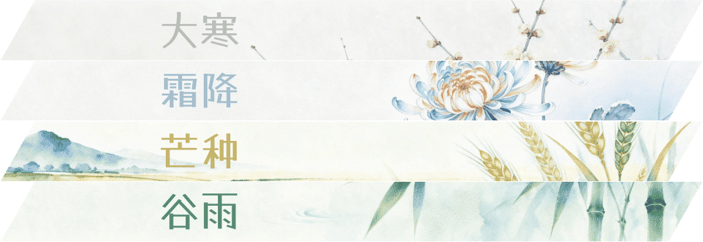
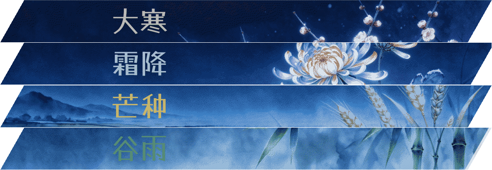

<p align="center">
  
</p>

<h1 align="center">风屿 · Wind Island</h1>

<p align="center">
  A restrained, serene Hexo blog theme focused on reading experience and visual aesthetics
</p>

<p align="center">
  <sub>Design inspired by <a href="https://github.com/DINGDANGMAOUP/moonlit-mountain">DINGDANGMAOUP/moonlit-mountain</a></sub>
</p>

<p align="center">
  <a href="https://hexo.io/"></a>
  <a href="./LICENSE"></a>
</p>

---

## ✨ Features

### 🏝️ Island Color System

Four season-inspired island color schemes, switchable in one click from the navigation bar, with smooth View Transition animations.

<p align="center">
  
  
</p>

| Island Color | Page BG | Surface BG | Description |
|---|---|---|---|
| **Night Island** 夜屿 | `#0F172A` Deep Ink Blue | `#1E293B` Twilight Indigo | Dark theme — restrained, default brand color |
| **Dusk Island** 暮屿 | `#1C2433` Dusk Blue-Gray | `#253040` Night Sky Gray | Blue hour meets afterglow, warm and cool intertwined |
| **Dawn Island** 晓屿 | `#F0F3F1` Mist Green-Gray | `#F8FBF9` Rice Paper White | Light theme — silver paper & ink, soft morning light |
| **Follow System** 随境 | — | — | Auto-switches Night / Dawn based on device preference |

### 🎨 Rich Theme Settings

Customize via `_config.wind-island.yml`:

- **Appearance** — Custom web fonts, default island color
- **Homepage** — Hero image, cover strip source (pinned / category / tag), featured categories, topic collections, contact page
- **Navigation** — Custom menus, social media icons with image popups
- **Articles** — Reading settings panel (font size, line height, content width), reading time estimation, table of contents
- **Footer** — ICP filing number, public security network filing number, copyright start year
- **Comments** — Optional comment support

### 🌍 Internationalization Built-in

Simplified Chinese, Traditional Chinese, English, 日本語, 한국어 — pure client-side i18n, switch languages without page refresh, covering all UI strings and accessibility labels.

### 📖 Reading Experience

- **Reading Settings Panel** — Font size / line height / content width adjustable in real time, preferences auto-saved
- **Table of Contents (TOC)** — Auto-generated, expandable / collapsible
- **Reading Time** — Automatic estimation for mixed Chinese/English content
- **Share** — One-click copy article link / native sharing
- **Print** — Print-optimized styles
- **Prev/Next Navigation** — Adjacent article links at the bottom of each post

### 🌿 Solar Term Atmosphere

The homepage Hero area dynamically displays the current solar term based on the Chinese 24 solar terms calendar, with season-appropriate visual ambiance.

### 📱 Responsive & Accessible

Mobile-friendly navigation and layout. ARIA labels, keyboard navigation, and semantic HTML throughout. Supports `prefers-reduced-motion`.

---

## 📦 Installation

### Option 1: Use This Repository Directly

This repository is a complete Hexo site — clone and use immediately:

```bash
git clone https://github.com/HP-L/halo-theme-wind-island.git
cd halo-theme-wind-island
npm install
```

Edit site information in `_config.yml`, then:

```bash
npx hexo server
```

### Option 2: Theme Only

Copy the `themes/wind-island/` directory into your existing Hexo project under `themes/`, then update your Hexo root `_config.yml`:

```yaml
theme: wind-island
```

Then create `_config.wind-island.yml` in your Hexo root directory, using `themes/wind-island/_config.yml` as a reference.

---

## 🚀 Local Development

### Requirements

- Node.js ≥ 18
- Hexo ≥ 7.0.0

### Commands

| Command | Description |
|---|---|
| `npx hexo server` | Start local dev server (default `http://localhost:4000`) |
| `npx hexo generate` | Generate static files to `public/` |
| `npx hexo clean` | Clear cache and generated files |
| `npx hexo new post "Title"` | Create a new post |

### Theme Development

Theme files are located in `themes/wind-island/`. Modify templates (`.ejs`), styles (`main.css`), or scripts (`main.js`) and refresh your browser to see changes. For JavaScript modifications, edit `themes/wind-island/source/js/main.js` directly (single bundled file).

---

## 📁 Project Structure

```
├── source/
│   ├── _posts/                    # Blog posts (Markdown)
│   ├── about/                     # About page
│   ├── categories/                # Categories page
│   └── tags/                      # Tags page
├── themes/
│   └── wind-island/               # Wind Island theme
│       ├── languages/             # i18n resources (zh-CN / zh-TW / en / ja / ko)
│       ├── layout/                # EJS templates
│       │   ├── _partial/          # Reusable fragments (footer / pagination / post-card etc.)
│       │   ├── layout.ejs         # Global layout
│       │   ├── index.ejs          # Homepage
│       │   ├── post.ejs           # Article page
│       │   ├── page.ejs           # Custom page
│       │   ├── archive.ejs        # Archives page
│       │   ├── categories.ejs     # Categories list
│       │   ├── category.ejs       # Category detail
│       │   ├── tags.ejs           # Tags list
│       │   ├── tag.ejs            # Tag detail
│       │   └── links.ejs          # Links page
│       ├── source/
│       │   ├── css/
│       │   │   ├── main.css       # Main styles (island color CSS variables)
│       │   │   └── fonts/         # Bundled fonts (GeneralSans)
│       │   ├── js/
│       │   │   ├── main.js        # Core interaction logic
│       │   │   └── i18n.js        # i18n runtime
│       │   └── images/            # Theme images & solar term illustrations
│       └── _config.yml            # Theme default configuration
├── _config.yml                    # Hexo site configuration
└── package.json
```

---

## 🤝 Contributing

1. Fork this repository
2. Create a branch `git checkout -b feature/your-feature`
3. Commit changes `git commit -m 'feat: add your feature'`
4. Push to branch `git push origin feature/your-feature`
5. Submit a Pull Request

---

## 📄 License

[MIT](./LICENSE) · Copyright (c) 2026 Phosphine · Design inspired by [DINGDANGMAOUP/moonlit-mountain](https://github.com/DINGDANGMAOUP/moonlit-mountain)

---

## 🔗 Links

- [GitHub Repository](https://github.com/HP-L/halo-theme-wind-island)
- [Issue Tracker](https://github.com/HP-L/halo-theme-wind-island/issues)
- [Hexo Documentation](https://hexo.io/docs/)